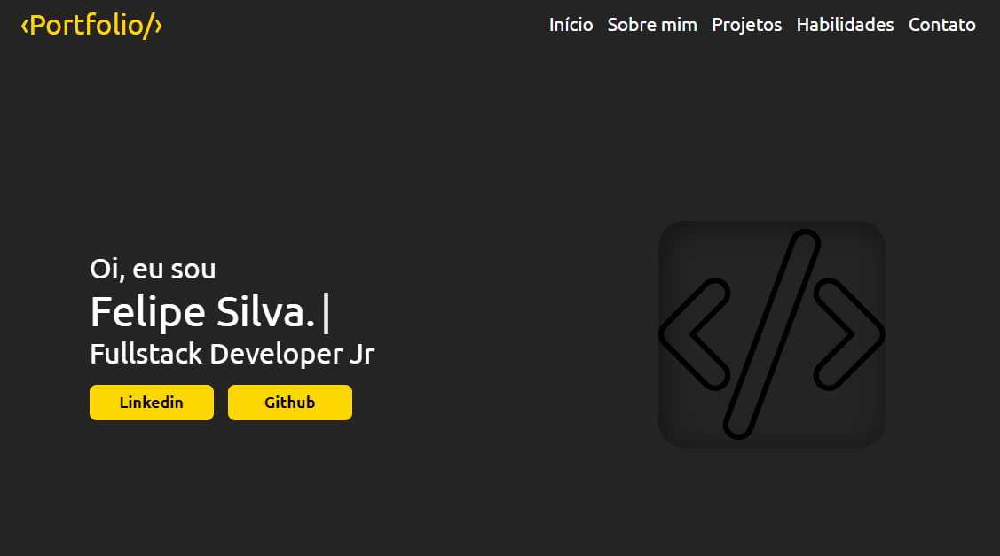

<h1 align="center">🌐 Portfólio</h1>

  

## :books: Informações
Desenvolvi esse site para apresentar meus projetos e para possíveis clientes poderem entrar em contato comigo.
<ul>
  <li>Para acessar o site: clique em <a href="https://felipesilva-cll.vercel.app/" target="_blank">Portfolio</a></li>
</ul>

## :pushpin: Tecnologias
<ul>
  <li><a href="https://developer.mozilla.org/pt-BR/docs/Web/JavaScript">JavaScript</a></li>
  <li><a href="https://developer.mozilla.org/pt-BR/docs/Web/HTML">HTML</a></li>
  <li><a href="https://sass-lang.com/documentation/">SCSS</a></li>
</ul>

## :memo: Feedback
Caso queira deixar alguma sugestão, por favor entre em contato comigo pelo <a href="mailto:Felipedev001@gmail.com">felipedev001@gmail.com</a> ou por alguma das redes sociais disponíveis no site.

## :balance_scale: Licença
Consulte o arquivo <a href="https://github.com/Felipe-Cll/Portfolio/blob/main/LICENSE" target="_blank">LICENSE</a> para obter mais detalhes.
